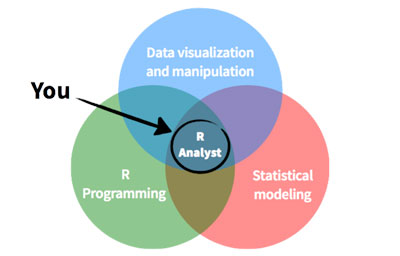

 

<h1>_Welcome to R-Tutorials!_</h1>

This is a small site dedicated to documenting some of the R knowledge I have gathered over the years. Most of the posts are meant to serve as a quick reference for some commonly used packages. Within each post are also a number of hyperlinks to other useful sites about that particular topic. Enjoy!

